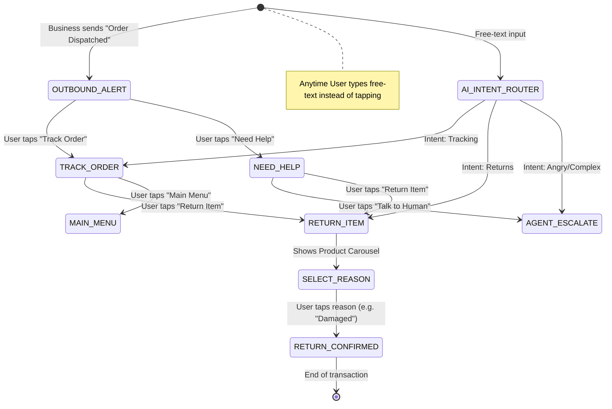

# E-Commerce RCS Conversation Flow

**Task:** rcs-vonage-poc
**Domain:** E-commerce (Order Tracking, Returns, Support)

## 1. Overview
This document outlines the state machine and interaction flow for the E-commerce RCS POC. It demonstrates the most valuable features of RCS:
- Rich media (Images, Cards)
- Carousels (for multiple products)
- Suggested Replies (structured input)
- Suggested Actions (Dial, Open URL, Location)
- AI Fallback (for free-text intents)

## 2. Conversation Flow Diagram

## 3. Step-by-Step UX

### Step 1: Outbound Dispatch Alert
**Message Type:** Rich Card (Standalone)
**Media:** Image of the brand/box
**Text:** "Hi {{name}}, your order #1234 (iPhone 17 Pro) has been dispatched and is arriving tomorrow."
**Suggested Replies/Actions:**
- 🟢 `Track Order` (Reply)
- 🔵 `Need Help` (Reply)

### Step 2: Track Order Selected
**Message Type:** Rich Card
**Media:** Map image / Status icon
**Text:** "Your package is currently at the local hub in Mumbai. Estimated delivery: Tomorrow by 6 PM."
**Suggested Replies/Actions:**
- 🟢 `Return Item` (Reply)
- 🔵 `View on Map` (Action: Open URL)
- 🔵 `Call Delivery Agent` (Action: Dial)

### Step 3: Return Item Selected
**Message Type:** Carousel (Up to 10 items)
**Media:** Images of products in the order
**Card 1:** iPhone 17 Pro -> Buttons: `[ Return This ]`
**Card 2:** AirPods Pro -> Buttons: `[ Return This ]`
*(User taps "Return This" for iPhone)*

### Step 4: Select Reason
**Message Type:** Text + Suggested Replies
**Text:** "Got it. Why are you returning the iPhone 17 Pro?"
**Suggested Replies:**
- `Defective/Damaged`
- `Changed my mind`
- `Wrong item`

### Step 5: Return Confirmed
**Message Type:** File Message + Text
**Media:** Return Label (PDF)
**Text:** "Your return is initiated. Please print the attached label. A pickup is scheduled for tomorrow."
**Suggested Actions:**
- `Add to Calendar` (Action: Calendar event for pickup)

### Step 6: AI Fallback (Free-text)
If the user types: "I want to cancel this order it's taking too long"
**LLM determines intent:** `Cancel_Order`
**System replies (Text):** "I understand you want to cancel. Let me check if the shipment can be stopped..." 
*(Follows up with cancellation status card)*

## 4. Required States (Redis/Memory)
- `IDLE`
- `AWAITING_TRACKING_ACTION`
- `AWAITING_RETURN_ITEM`
- `AWAITING_RETURN_REASON`
- `COMPLETED`
